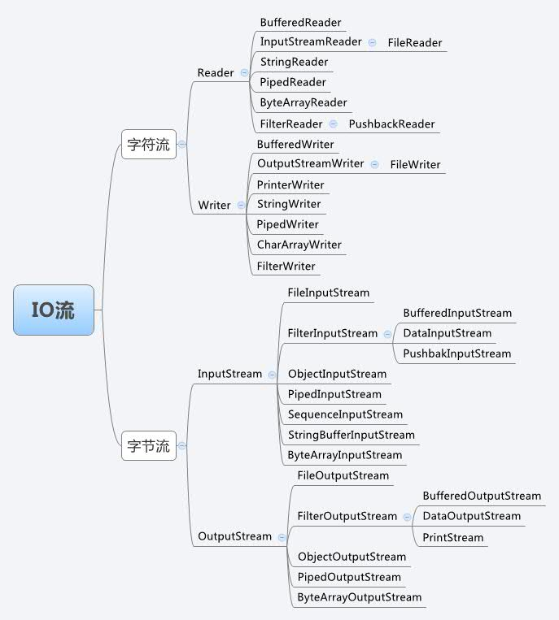

* content
{:toc}

网上一张图


按字符字节分成两部分，[字符字节有关概念](/2018/06/18/编码区别)

从设计模式上看，最主要使用了两种设计模式，
[结构型设计模式](/2018/04-28/结构型)
1. 适配器模式
InputStream（被适配）
InputStreamReader（适配器，新功能，能读字符了）,构造方法：
``` 
  /**
      * Creates an InputStreamReader that uses the default charset.
      *
      * @param  in   An InputStream
      */
     public InputStreamReader(InputStream in) {
         super(in);
         try {
             sd = StreamDecoder.forInputStreamReader(in, this, (String)null); // ## check lock object
         } catch (UnsupportedEncodingException e) {
             // The default encoding should always be available
             throw new Error(e);
         }
     }
 ```
 使用：
 ``` 
  File file = new File ("hello.txt");   
  FileInputStream in=new FileInputStream(file); 
  InputStreamReader inReader=new InputStreamReader(in); 
  ```

2. 装饰者模式
拿几个类:   
InputStream(超类)、   
FileInputStream(被装饰，事先写好，不好修改)、    
FilterInputStream（装饰者父类）、   
BufferedInputStream（装饰者出来的类，新功能，能使用缓存技术对File操作）   
所以使用的代码就变成了这样
```
File file = new File ("hello.txt"); 
FileInputStream in = new FileInputStream(file); 
BufferedInputStream inBuffered = new BufferedInputStream (in); `
 ```
OutputStream 同理